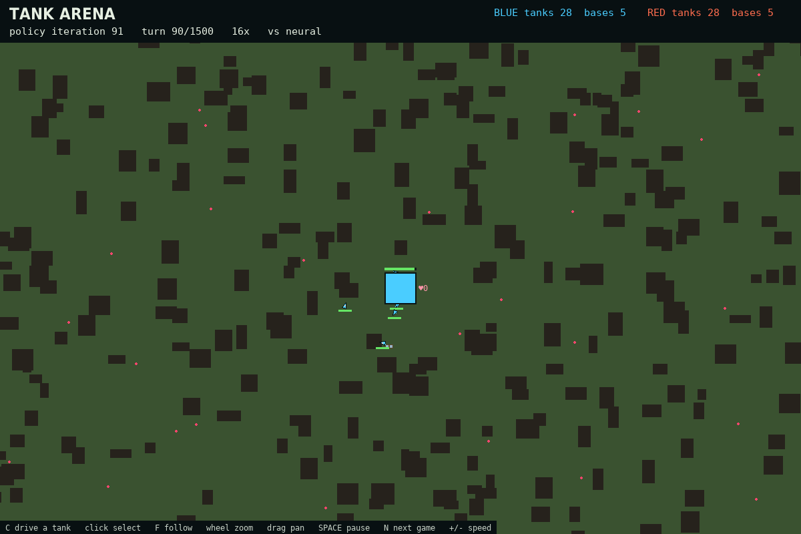
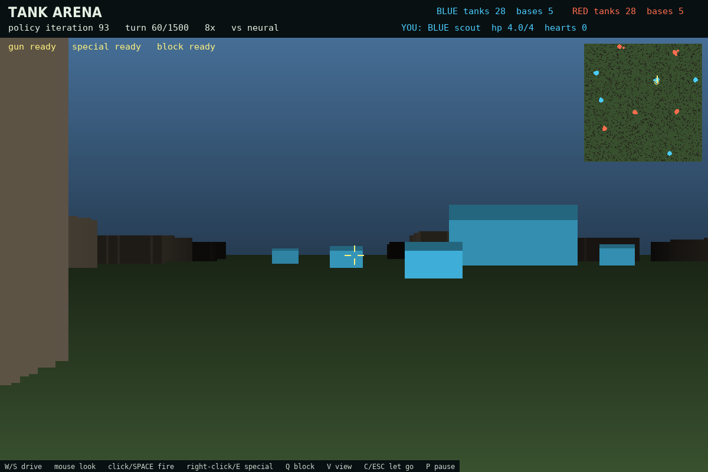

# Multi-Agent Tanks

Two armies of tanks fight over a maze. Every tank and every base on the board is
controlled by the **same neural network**, trained from scratch by self-play on a
single GPU. Nothing about tactics is scripted: the network decides where each tank
drives, when it shoots, when a scout ferries supplies or patches up a wounded ally,
where barricades go up, what the bases build, and what each unit writes onto the
team's shared **map of the war** for the others to read.

The goal of the project is to see how much coordinated, strategic behaviour —
squads, base defence, sieges, supply lines, medics, fortifications — can *emerge*
from reward design and self-play alone, and to make that fast enough to iterate on
in minutes rather than days.



---

## Quick start

```bash
pip install -r requirements.txt    # PyTorch with CUDA, numpy, scipy, pygame-ce, tensorboard

python train.py                    # train from scratch; writes tank_policy.pt every iteration
tensorboard --logdir runs          # watch the curves
python viewer.py                   # watch (or play) the current policy, live, while it trains
```

Training needs a CUDA GPU (it was developed on an NVIDIA DGX Spark / GB10). The
viewer runs on the CPU, so it doesn't steal time from training, and it reloads the
weights automatically whenever `train.py` saves new ones.

| file | what it is |
|---|---|
| `arena.py` | the game: map generation (four terrain styles), physics, sensors, rewards, and a scripted benchmark bot |
| `train.py` | the policy network (encoder → shared team map → GRU memory) and self-play PPO on three board sizes |
| `viewer.py` | live pygame viewer: a top-down overview with the team map overlaid, and a first-person mode to play a tank yourself |
| `report/collect.py` | gathers every number a write-up needs from a finished run |
| `docs/HISTORY.md` | how the design got here: what was tried, what failed, and why |

---

## The game

The board is a **1125 × 1125** field of rock in one of four terrain styles — rubble
(lots of small rocks), boulders (fewer, bigger), corridors (long thin walls) or open
(sparse rocks). Each team has **5 bases**, spread at least 250 tiles apart, and
starts with **28 tanks** in a ring around its bases, with room to build up to 40.
Board size and army size are parameters: training runs three sizes at once (see
[Training](#training)) and the viewer will play any.

**Winning:** a team that loses all of its bases loses. If both still have bases when
the 1500-turn clock runs out, the team with more bases wins (more tanks breaks a
tie). Losing every tank doesn't end the game — a base with supplies can build more.

| unit | per team | hp | speed | what it does |
|---|---|---|---|---|
| scout | 6 | 4 | fast (3) | collects hearts (carries 3); unloads them at a friendly base, or spends one to heal a teammate within 4 tiles |
| soldier | 18 | 6 | medium (2) | fires bullets |
| heavy | 4 | 8 | slow (1.5) | fires bullets, plus a slow missile that flies over walls |
| base | 5 | 40 | stationary | long-range missile (5× a tank's reach), sees 5× farther, spends stored hearts |

**Hearts** are the only resource. They lie scattered around the map, only scouts can
carry them, and a base spends them on one of four orders: **repair** (itself and
every tank next to it, 1 heart), **build** a scout / soldier / heavy (2 / 5 / 10
hearts), or **raise a wall** — a row of 5 blocks, 14 tiles out in the direction the
base's turret is pointing (1 heart).

**Blocks:** any tank can drop a 2 × 2 block just ahead of it, once every 4 turns.
Blocks stop tanks and bullets like rock does, but break after 3 hits (missiles fly
over both). A team can have at most 60 standing. Friendly fire is on — for bullets,
and for shooting your own team's blocks.

## What an agent senses

Each agent gets a 196-number observation, with the same layout for tanks and bases:

- **itself** — its role, health, hearts carried, cooldowns, position, heading, and
  how many tanks and bases each side still has;
- **radar** — 16 sectors all the way round, reaching 160 tiles, *through walls*. Per
  sector: the nearest rock and placed block along the sector's centre line, the
  nearest friendly and enemy tank, the most badly hurt friendly tank, the nearest
  friendly and enemy base (bases show up at any distance), **how many enemy tanks
  are closing on a friendly base** in that direction, and **how damaged the enemy
  base** there is;
- **vision** — 9 sectors in a forward cone, 48 tiles, *blocked by walls*. Per
  sector: rock, placed blocks, the nearest enemy, and the nearest heart.

Bases see five times farther on both. Every distance is normalised, so a policy
trained on the small board plays the big one unchanged.

## The network

One network is shared by every agent on both teams; agents are told apart only by
what they observe.

```
                                    team map (24 × 24 sectors × 16 numbers, one per team)
                                          ▲ write (gated)          │ read: 5 × 5 sectors round me
                                          │                        │       + the whole map pooled to 6 × 6
observation ─► encoder (2 × 512) ─► [encoded observation, what I read] ─► GRU memory (512) ─► 5 action heads + value
```

- **The team map.** Each team keeps a grid of **24 × 24 sectors** laid over the
  board — whatever the board's size, so the same network plays a 400-tile skirmish
  and an 1125-tile war — and every sector holds a 16-number vector. Every turn each
  living unit **writes** to the vector of the sector it is standing in (a gated
  update: it decides how much to overwrite and with what), and **reads** the 5 × 5
  sectors around it plus a coarse 6 × 6 pooling of the whole board. Nothing about
  what the numbers mean is designed: the map is part of the same differentiable
  network, so a reader's policy gradient teaches the writers what is worth putting
  down. Sectors nobody has visited fade slowly, so stale reports don't linger. This
  replaced a radio in which every agent broadcast to everyone at once; a spatial
  map is what a war room actually needs — *where* things are — and it is the only
  channel between teammates.
- **Memory.** A GRU lets an agent remember recent turns: an enemy that went behind
  a wall, which way the squad was heading. It is wiped when an agent dies or its
  game ends.
- **Actions** (all discrete): move (3 throttle × 3 steering), fire, special
  (missile / unload / heal), base order (6 choices), and place block.

## Training

`train.py` is self-play PPO, built around keeping the GPU busy:

- **1024 games at once.** Every agent of every game is one row of a single
  `(games, agents, …)` tensor, and `torch.compile` fuses the sensors and physics
  into a handful of GPU kernels. Games reset independently, so training is a
  continuous stream of 32-turn rollouts.
- **Three board sizes, four terrains.** Iterations take turns on a small board
  (400 tiles, 14 tanks and 3 bases a side, 1536 games), the medium one (560, 28, 5,
  1024 games) and a large one (800, 40, 7, 512 games), each game on one of sixteen
  maps in the four terrain styles — so the policy has to work at every scale and
  in every kind of terrain, not memorise one arena.
- **Recurrent PPO.** The update replays each game's rollout in order through the
  GRU *and the team map* (backpropagation through time), starting from the memory
  the rollout began with. Minibatches are 32 whole games, 3 epochs per iteration, in
  bf16.
- **Opponents.** Both sides of most games are the current policy. In a quarter of
  the games one side is played by someone else — half by a frozen **past snapshot**
  of the policy (a pool of the last 10, refreshed every 50 iterations), half by the
  scripted **raider** bot — so the policy can't forget how to beat older styles and
  has to handle an all-out rush.
Every 100 iterations it saves a snapshot to `checkpoints/` and plays full evaluation
games on the medium board against the raider and against a copy of itself **cut off
from the team map** — if the map carries anything useful, that copy should lose.

```bash
python train.py --minutes 120            # stop after two hours (default: run until Ctrl-C)
python train.py --resume                 # continue from tank_policy.pt
python train.py --arenas medium,large    # a subset of the board sizes
```

The training log prints one line per iteration; `moving` (the share of tank turns
that aren't "stand still") is the first number because a policy that stops moving is
the most common way a reward change goes wrong.

## Rewards

This is where most of the work went. Each term is there because, without it,
self-play found something degenerate instead — [docs/HISTORY.md](docs/HISTORY.md)
tells those stories. All the weights are named constants near the top of `arena.py`.

**Individual credit.** +1 per kill, +0.2 per damage dealt, −0.03 per wasted shot,
−1 for dying. Hitting a teammate costs what hitting an enemy earns (−0.2 per
damage), and killing one costs −2.

**Team spirit.** Every agent's reward is blended 30 % with its team's average, so
helping the team pays even when someone else lands the kill (the same trick OpenAI
Five used).

**Bases.** Losing has to hurt more than winning pays, or teams happily trade bases:

- attacking: +3 to the tank that destroys a base, +0.1 extra per damage to a base,
  and +2 to every member of the team that takes it;
- defending: −4 to every member per base lost (−8 to the base itself), and damage
  to an enemy within 60 tiles of one of your bases is worth three times as much;
- the game: +3 for winning outright, −6 for losing (±1.5 / −3 if decided on the clock).

**Squads.** A soldier or heavy pays up to −0.01 a turn for drifting away from its
comrades (nothing while its second-nearest ally is within 12 tiles, all of it 40
tiles beyond), and the same again once it has gone 60 turns without hitting an enemy — so a group has to fight
together, not just huddle. Every tank that hit an enemy in the 20 turns before it
died gets +1, as much as the killer, so focusing fire pays. A comrade dying close by
costs a little (−0.05, or −0.15 for a heavy). Only actually overlapping another tank
is penalised (−0.1 a turn). These squad terms are deliberately mild: early in
training, when nothing can aim yet, every one of them lands on *doing something*, and
at twice these values fresh policies learned to stand still.

**Barricades.** A scattered block costs −0.15; one that extends a wall of your team's
blocks is free. The tank that placed a block earns +0.5 for every enemy bullet it
stops, and +0.1 for every enemy tank it stops near one of its bases.

**Economy and medics** — kept small on purpose: shared through team spirit, big
economy rewards taught entire armies to stay home and farm. +0.1 per heart picked
up, +0.4 per heart delivered, +0.5 per hp a scout heals and +0.5 more for reaching an
ally below 35 % health, +0.1 per heart a base spends on a tank and per wall block.

## The viewer

```bash
python viewer.py                                  # the full 1125 board, 28 tanks and 5 bases a side
python viewer.py --grid 200 --tanks 10 --bases 1  # a small skirmish
python viewer.py --opponent raider                # the policy (blue) against the scripted bot (red)
```

Zoomed in, tanks are drawn with treads, hull, turret and barrel (a yellow turret is
a heavy; a scout carrying a heart shows it); zoomed out they are arrowheads. Bases
are big squares with a health bar, their stored hearts, and a turret showing where
a wall order would go. Dark rock is permanent, sandy blocks are placed barricades
tinted by team, bullets leave a trail, and units that die burst. The HUD shows the
board size and terrain style. When a game ends the next one starts three seconds
later with the latest weights.

**The team map:** press **M** to overlay what blue's units have written about each
sector of the board, again for red's, and again to hide it. Colour comes from the
first three numbers of each sector's vector and opacity from how much has been
written there, so you can see the team's picture of the war build up and fade —
and, in first person, the same overlay on the minimap.

**Markers:** every base on either side is always marked — on screen it is visible
itself, off screen a square in its team's colour is pinned to the edge of the view
with an arrow and its distance (a grey square is a destroyed base). Once you select
or drive a tank, every tank within its radar range (160 tiles) gets a triangle tag
with its distance, off-screen ones at the edge too. In first person the markers sit
on the horizon like waypoints, and the ones behind you stack down the sides. **K**
hides them.

**Watching:** the mouse wheel zooms, drag pans, click selects a unit, **F** follows
it, **Space** pauses, **N** skips to a new game, and **+ / −** change the speed.

**Playing:** press **C** to take over the selected tank (or a random blue one). The
game slows to 8 turns a second and the network keeps controlling everyone else,
your teammates included. **V** switches between two views:

- **top-down** — the camera follows you, and your tank turns to face the mouse;
- **first person** — a raycast 3D view from the tank, with towering rock, chest-high
  barricades, the other tanks and bases, bullets and hearts, and a minimap. The mouse
  is captured: move it to look around, and the tank turns to follow.

**W / S** drive, **click** or **Space** fires, **right-click** or **E** is the special,
**Q** drops a block, **P** pauses, and **C** or **Esc** hands the tank back.



## Collecting results

```bash
python report/collect.py
```

This plays the saved checkpoints and writes `report/data/`:

- `scalars.csv` — every TensorBoard curve;
- `behaviour.csv` — behaviour per checkpoint: fire discipline, whether hurt tanks
  back off, how often soldiers are grouped, how many defenders turn up at a
  threatened base versus a quiet one, siege group sizes, economy, heals, barricades;
- `ladder.csv` — the final policy against earlier checkpoints;
- `radio.json` — the team-map test (a copy cut off from its map), and **what the
  map encodes**: how well the amount written in each sector tracks where enemy
  tanks and own tanks actually are;
- `raider.json` and `speed.json` — the scripted-bot benchmark and throughput.

`report/baseline_mean_radio/` keeps the code and training log of an earlier
generation — a radio that simply averaged every teammate's message — for comparison.

## Performance notes

- On an idle GB10 one game-turn for all 1024 medium games takes about 60 ms
  (physics ~37 ms, sensors ~22 ms): roughly **1.5 million agent-steps per second**
  before the network. A full training iteration — 32 turns of every game plus the
  PPO update — takes 7–10 seconds depending on the board.
- The team map costs little: reads are one gather (25 sectors per agent) and one
  average-pool; writes are three scatter-adds. All of it is fused by `torch.compile`.
- Cost grows with the square of the army size (radar, radio and bullet hits compare
  every agent with every other), which is why armies are 28 a side rather than 280.
- Placed blocks live in one grid cell per 2 × 2 tiles — 80 million cells across 1024
  games — so every block update happens in place. Copying that grid each turn once
  cost more than the rest of the physics put together.
- The viewer's single game runs on 8 CPU threads: with all 20, thread hand-offs made
  every turn three times slower.
